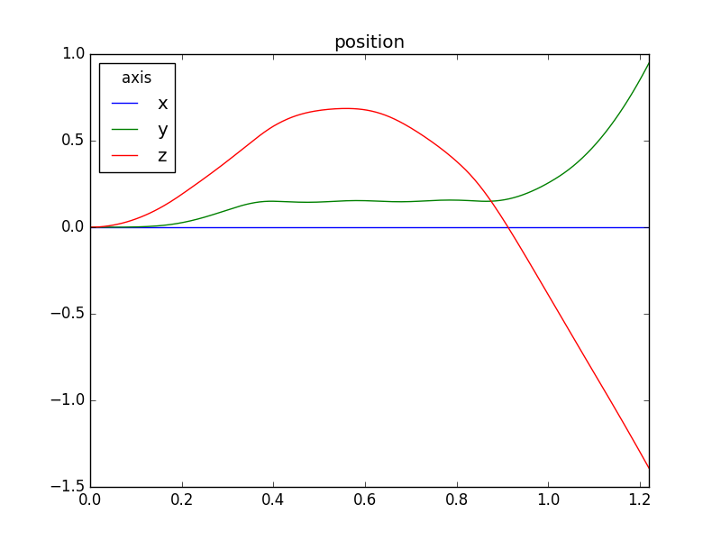
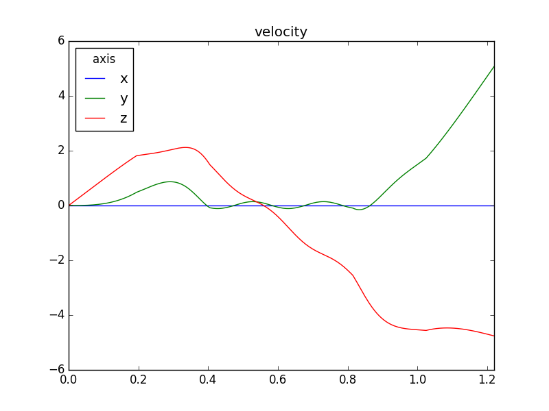
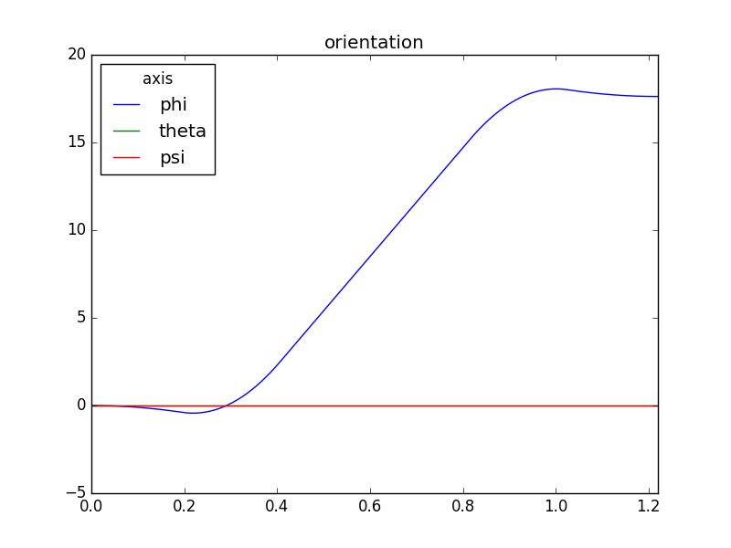
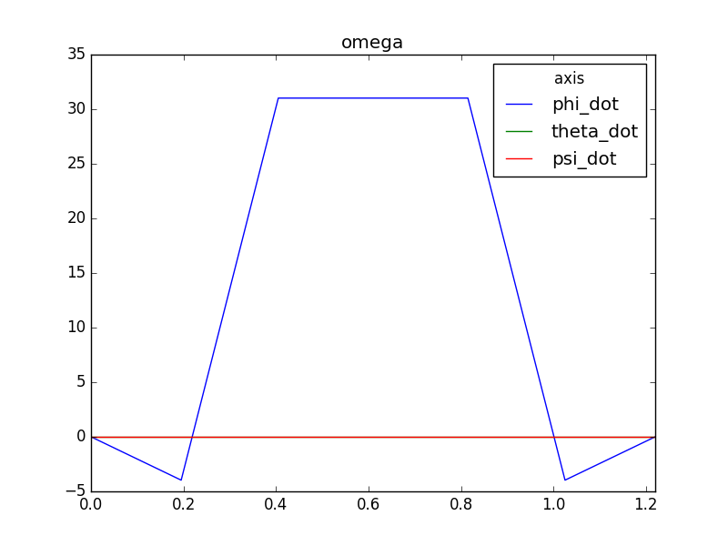

## High Speed Quadrotor flips Simulation

Largely based on the work of https://github.com/nikhilkalige and http://www.kostasalexis.com/simulations-with-simpy.html

### Testing
```
pytest tests
```

### Running
The `multiflips_example.py` script can be used to generate matplotlib flight plots or generate data for blender.
```
usage: python multi_flips.py
```





### References

1. A Simple Learning Strategy for High-Speed Quadrocopter Multi-Flips
 - Sergei Lupashin, Angela Sch ̈ollig, Michael Sherback, Raffaello D’Andrea
2. Adaptive Open-Loop Aerobatic Maneuvers for Quadrocopters
 - Sergei Lupashin, Rafaello D’Andrea
3. Adaptive fast open-loop maneuvers for quadrocopters
 - Sergei Lupashin, Rafaello D’Andrea
